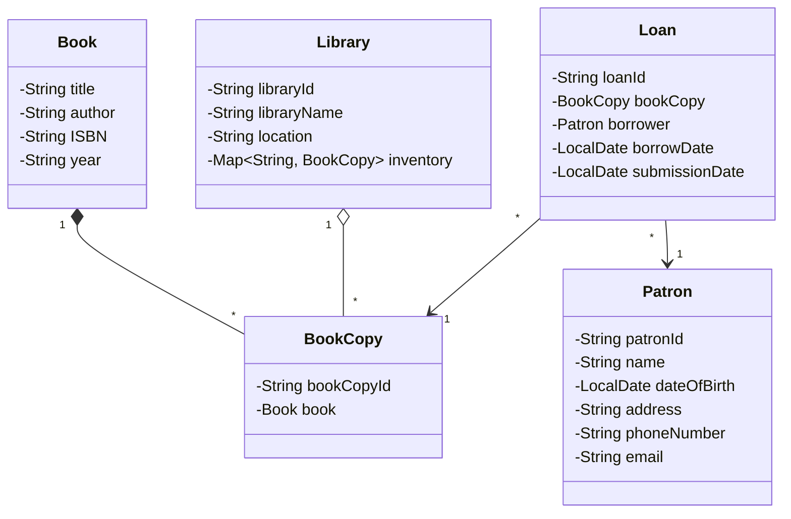

# 📚 Library Management System

A layered, console-based Library Management System implemented in Java.

This project demonstrates strong understanding of:
- Object-Oriented Programming (OOP)
- Layered Architecture
- Factory Pattern
- Validation Layer
- Custom Exception Handling
- Clean Separation of Concerns

---

## 🚀 Features

- Add and manage Books
- Maintain Library Inventory
- Register and manage Patrons
- Issue and Return Books (Loan Management)
- Input validation
- Unique ID generation
- Custom exception handling
- Console-based interactive menu

---

## 🏗️ Architecture Overview

The system follows a layered architecture:

```
Console UI → Service Layer → Repository Layer → Entities
```

### Layers:

- **Entities** → Core domain models  
- **Repositories** → In-memory data storage  
- **Services** → Business logic  
- **Factories** → Object creation  
- **Validator** → Input validation  
- **Custom Exceptions** → Error handling  

---

## 📦 Entities

- Book
- BookCopy
- Library
- Loan
- Patron

---

## 📂 Project Structure

```
.
├── entity
│   ├── Book.java
│   ├── BookCopy.java
│   ├── Library.java
│   ├── Loan.java
│   └── Patron.java
│
├── repository
│   ├── BookRepo.java
│   ├── LibraryRepo.java
│   ├── LoanRepo.java
│   └── PatronRepo.java
│
├── service
│   ├── BookService.java
│   ├── InventoryService.java
│   ├── LendingService.java
│   ├── LibraryService.java
│   └── PatronService.java
│
├── factory
│   ├── BookCopyFactory.java
│   └── LoanFactory.java
│
├── exception
│   ├── EntityNotFoundException.java
│   └── InvalidInputException.java
│
├── util
│   └── IdGenerator.java
│
├── validation
│   └── Validator.java
│
└── ui
    └── ConsoleMenu.java
```

---

## 📊 UML Class Diagram



---

## 🧠 Design Principles Applied

- Encapsulation
- Single Responsibility Principle (SRP)
- Separation of Concerns
- Factory Pattern
- Defensive Programming (Validation Layer)
- Custom Exception Handling
- Composition & Aggregation Relationships

---

## ▶️ How to Run

1. Clone the repository:

```
git clone <your-repo-url>
```

2. Open in IntelliJ or any Java IDE.

3. Run the `Main` class.

4. Use the console menu to interact with the system.

---

## 🔮 Future Enhancements

- Reservation Queue System
- Notification System (Observer Pattern)
- Database integration
- REST API layer
- Unit testing (JUnit)

---

## 🎯 Concepts Demonstrated

- Object-Oriented Design
- Layered Architecture
- In-memory Repository Pattern
- Factory Pattern
- Custom Exception Handling
- Java Collections
- Java Time API (LocalDate)

---


