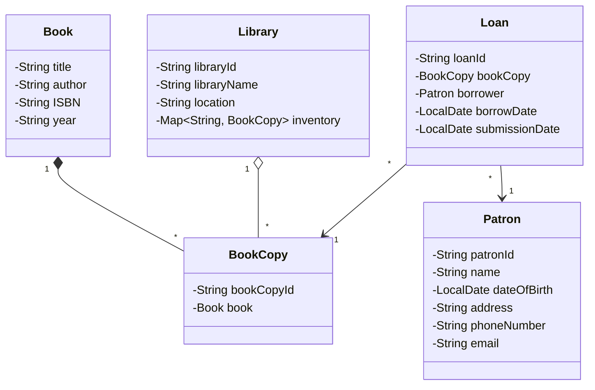

```mermaid
classDiagram

class Book {
    -String title
    -String author
    -String ISBN
    -String year
}

class BookCopy {
    -String bookCopyId
    -Book book
}

class Library {
    -String libraryId
    -String libraryName
    -String location
    -Map~String, BookCopy~ inventory
}

class Loan {
    -String loanId
    -BookCopy bookCopy
    -Patron borrower
    -LocalDate borrowDate
    -LocalDate submissionDate
}

class Patron {
    -String patronId
    -String name
    -LocalDate dateOfBirth
    -String address
    -String phoneNumber
    -String email
}

%% Relationships

Book "1" *-- "*" BookCopy
Library "1" o-- "*" BookCopy
Loan "*" --> "1" BookCopy
Loan "*" --> "1" Patron
```
